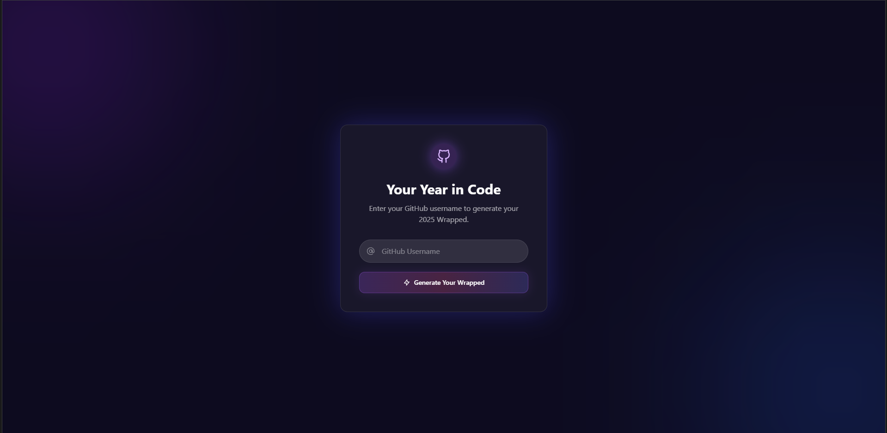

# 🎯 GitHub Wrapped

A beautiful, personalized year-in-review experience for your GitHub activity. Get insights into your coding journey with stunning visualizations, stats, and AI-generated highlights.


## ✨ Features

- 📊 **Comprehensive Stats** - Total commits, repositories, stars, and more
- 📈 **Commit Activity Timeline** - Visual representation of your coding patterns throughout the year
- 🎨 **Top Languages** - Beautiful chart showing your most-used programming languages
- 🏆 **Top Repositories** - Showcase your most popular and active projects
- 🤖 **AI-Powered Highlights** - Personalized achievements generated with Google Gemini AI
- 📸 **Shareable Cards** - Export your wrapped as a beautiful image for social media
- 🎭 **Smooth Animations** - Engaging user experience with Framer Motion
- 🌐 **No Login Required** - Works with public GitHub data only

## 🚀 Demo

[Live Demo](https://github-wrapped-sepia.vercel.app/)

## 🛠️ Tech Stack

### Frontend
- **React 19** - UI library
- **Vite** - Build tool and dev server
- **Tailwind CSS** - Utility-first CSS framework
- **Framer Motion** - Animation library
- **Chart.js** - Data visualization
- **React Router** - Client-side routing
- **Axios** - HTTP client
- **Lucide React** - Icon library

### Backend
- **Node.js** - Runtime environment
- **Express.js** - Web framework
- **GraphQL** - GitHub API queries
- **Google Generative AI** - AI-powered highlights
- **CORS** - Cross-origin resource sharing

## 📋 Prerequisites

- Node.js (v18 or higher)
- npm or yarn
- GitHub Personal Access Token
- Google Gemini API Key

## 🔧 Installation

1. **Clone the repository**
```bash
git clone https://github.com/tolgab35/github-wrapped.git
cd github-wrapped
```

2. **Install backend dependencies**
```bash
cd backend
npm install
```

3. **Install frontend dependencies**
```bash
cd ../frontend
npm install
```

4. **Configure environment variables**

Create a `.env` file in the `backend` directory:
```env
GITHUB_TOKEN=your_github_personal_access_token
GEMINI_API_KEY=your_google_gemini_api_key
PORT=3001
```

To get your API keys:
- **GitHub Token**: Go to GitHub Settings → Developer Settings → Personal Access Tokens → Generate new token (classic)
  - Required scopes: `read:user`, `repo` (for public repositories)
- **Gemini API**: Visit [Google AI Studio](https://makersuite.google.com/app/apikey)

## 🏃‍♂️ Running the Application

1. **Start the backend server**
```bash
cd backend
npm start
```
The server will run on `http://localhost:3001`

2. **Start the frontend development server**
```bash
cd frontend
npm run dev
```
The app will run on `http://localhost:5173`

3. **Open your browser** and navigate to `http://localhost:5173`

## 📦 Building for Production

### Frontend
```bash
cd frontend
npm run build
```
The production build will be in the `dist` folder.

### Backend
The backend is ready for deployment as-is. Make sure to set environment variables on your hosting platform.

## 🌐 Deployment

### Frontend (Vercel)
The project includes a `vercel.json` configuration for easy deployment:
```bash
cd frontend
vercel deploy
```

### Backend (Heroku, Railway, etc.)
Deploy the backend to your preferred Node.js hosting platform and update the API URL in the frontend.

## 📸 Screenshots



## 🤝 Contributing

Contributions are welcome! Please feel free to submit a Pull Request.

1. Fork the repository
2. Create your feature branch (`git checkout -b feature/AmazingFeature`)
3. Commit your changes (`git commit -m 'Add some AmazingFeature'`)
4. Push to the branch (`git push origin feature/AmazingFeature`)
5. Open a Pull Request

## 📝 License

This project is licensed under the MIT License - see the [LICENSE](LICENSE) file for details.

## 👤 Author

**Tolga B.**
- GitHub: [@tolgab35](https://github.com/tolgab35)

## 🙏 Acknowledgments

- GitHub API for providing comprehensive user data
- Google Gemini for AI-powered insights
- All the amazing open-source libraries used in this project

## 📞 Support

If you have any questions or run into issues, please open an issue on GitHub.

---

⭐ If you found this project helpful, please give it a star!
